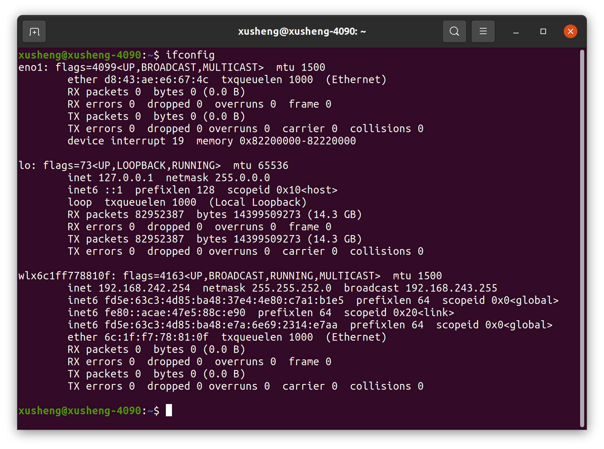

# README

## 📋 目录

- [Atom SDK 使用手册](#atom-sdk-使用手册)
  - [📦 编译](#-编译)
  - [🔎 包结构解析](#-包结构解析)
  - [🔧 配置](#-配置)
    - [1. 网络连接](#1-网络连接)
    - [2. DDS配置](#2-dds配置)
  - [🎮 例程运行](#-例程运行)
    - [1. 运行高层RPC例程](#1-运行高层rpc例程)
    - [2. 运行底层DDS例程](#2-运行底层dds例程)
    - [3. 运行关节录制例程](#3-运行关节录制例程)

# Atom SDK 使用手册

本手册为 Dobot Atom 机器人 SDK 提供完整使用指南，包含 编译、包结构解析、配置、例程运行 等内容。

## 📦 编译

这里假设工作路径为`/home/atom/workspace`，用户可根据自身情况进行修改

```bash
cd /home/atom/workspace/dobot_atom_sdk
mkdir build
cd build
cmake ..
make
```

**编译成功：**
build 目录下会生成 `rpc_test`（高层 RPC 例程）、`bridge_test`（底层 DDS 例程）、`record_joint`（关节录制例程）等可执行文件。

## 🔎 **包结构解析**

| **目录路径**               | **核心内容与作用**                                                                                                                                                                                                 |
|----------------------------|---------------------------------------------------------------------------------------------------------------------------------------------------------------------------------------------------------------------|
| `dobot_atom_sdk/common`    | 通用头文件：支撑所有例程的基础功能。                                                                                                                                                                                |
| `dobot_atom_sdk/config`    | 配置文件目录：<br>- `cyclonedds.xml`：DDS 通信配置；<br>- `controlParams.json`：关节 PID 控制参数；<br>- `joint_angles.txt`：关节轨迹文件（供底层 DDS 例程使用）。                                                      |
| `dobot_atom_sdk/example`   | 示例代码目录：<br>- `rpc_test.cpp`：高层 RPC 控制（FSM 切换、速度控制）；<br>- `bridge_test.cpp`：底层 DDS 控制（关节轨迹跟踪）；<br>- `record_joint.cpp`：关节角度录制（生成关节轨迹文件）。                           |
| `dobot_atom_sdk/idl`       | DDS 接口定义文件（IDL）：例如 `bms_cmd.idl`（电池管理系统指令）、`main_nodes_state.idl`（机器人节点状态）。CycloneDDS 基于这些文件生成 C 语言数据类型（存储于 `build/generated_dds` 目录）。                           |
| `dobot_atom_sdk/rpc`       | RPC 客户端接口目录：<br>- `base_rpc_client.h`：RPC 基础通信逻辑；<br>- `algs_rpc_client.h`：运动控制 RPC 接口；<br>- `gcontrol_rpc_client.h`：语音/设备控制 RPC 接口；                                                 |
| `dobot_atom_sdk/build`     | 编译输出目录：存放编译生成的可执行文件、中间文件等。                                                                                                                                                                |                                                                                                                                                               |

## 🔧 配置

### 1. 网络连接

用网线的一端连接机器人，另一端连接用户电脑，打开终端，执行 ping 命令：

```bash
ping 192.168.8.234
```

若出现以下信息，说明连接成功：

```bash
64 bytes from 192.168.8.234: icmp_seq=1 ttl=64 time=0.567 ms
64 bytes from 192.168.8.234: icmp_seq=2 ttl=64 time=0.612 ms
```

### 2. DDS配置

在终端中输入`ifconfig`查询网卡名称，如下图所示，可知网卡名称为wlx6c1ff778810f。



打开`dobot_atom_sdk/config/cyclonedds.xml`文件，将`eth0`替换为查询所得的网卡名称。

## 🎮 例程运行

`dobot_atom_sdk/build` 文件夹目录中 `rpc_test` 为高层 RPC 例程，`bridge_test` 为底层 DDS 例程。例程详细介绍见 《软件服务接口》 。

> ⚠️Warning: 运行以下例程时，机器人会移动，运行前请确保您所处环境安全。
> 

### 1. 运行高层RPC例程

**功能：**
通过命令行交互，控制机器人 FSM 状态切换（如待机→行走）、速度控制（前后左右移动）。

```bash
cd build
./rpc_test
```

**交互操作：**
输入 1 → 进入 FSM 状态控制：先显示当前 FSM ID，再输入目标 ID；
输入 2 → 进入速度控制：需先切换到支持速度控制的 FSM 状态（如 301 或 302），否则会提示 “SetVel failed. Please enter fsm 301 or 302.”

> ⚠️Warning: 运行以下例程时，请确保机器人已切换至调试状态。
> 

### 2. 运行底层DDS例程

**功能：**
读取预设轨迹`config/joint_angles.txt`，通过 DDS 通信控制机器人关节跟踪预设轨迹。

```bash
cd build
./bridge_test
```

### 3. 运行关节录制例程

**功能：**
采集机器人关节角度，保存到`joint_angles.txt`，并自动追加 “反向轨迹”（让关节恢复至初始位置），生成的文件可供`bridge_test`使用。

```bash
cd build
./record_joint
```

**录制过程：**
程序启动后的5 秒内不会记录轨迹，可手动调整机器人关节到初始位置；
5秒后开始录制，终端会显示当前录制时间；
录制完成后，build 目录下会生成 `joint_angles.txt`，可复制到 config 目录替换原文件，供 `bridge_test` 使用。
