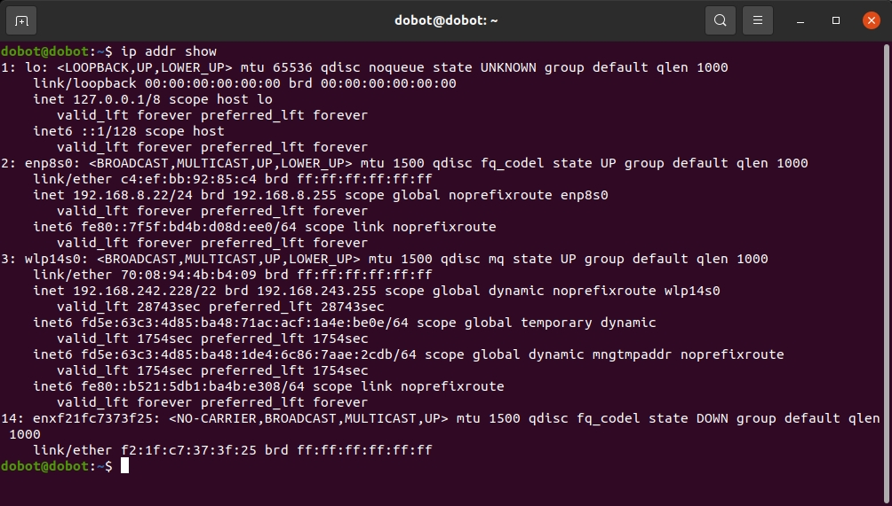

[English](README_en.md) | 中文

# 📋 目录

- [📋 目录](#-目录)
- [Atom SDK 使用手册](#atom-sdk-使用手册)
  - [**🖥 运行环境**](#-运行环境)
  - [📦 编译](#-编译)
  - [🔎 **包结构解析**](#-包结构解析)
  - [🔧 配置](#-配置)
    - [1. 网络连接](#1-网络连接)
    - [2. DDS配置](#2-dds配置)
  - [🎮 例程运行](#-例程运行)
    - [1. 运行高层RPC例程](#1-运行高层rpc例程)
    - [2. RPC例程内主要函数介绍](#2-rpc例程内主要函数介绍)
    - [3. 运行底层DDS例程](#3-运行底层dds例程)
    - [4. DDS例程内主要函数介绍](#4-dds例程内主要函数介绍)
    - [5. 运行关节录制例程](#5-运行关节录制例程)
    - [6. 运行摇杆控制例程](#6-运行摇杆控制例程)

# Atom SDK 使用手册

本手册为 Dobot Atom 机器人 SDK 提供完整使用指南，包含 编译、包结构解析、配置、例程运行 等内容。

## **🖥 运行环境**

- **OS:** Ubuntu 20.04 LTS
- **Compiler:** GCC 9.4.0

## 📦 编译

这里假设工作路径为 `/home/atom/workspace`，用户可根据自身情况进行修改

```bash
cd /home/atom/workspace/dobot_atom_sdk
mkdir build
cd build
cmake ..
make
```

**编译成功：**

build 目录下会生成 `rpc_test`（高层 RPC 例程）、`bridge_test`（底层 DDS 例程）、`record_joint`（关节录制例程）等可执行文件。

## 🔎 **包结构解析**

| **目录路径**             | **核心内容与作用**                                                                                                                                                                                  |
| ------------------------ | --------------------------------------------------------------------------------------------------------------------------------------------------------------------------------------------------- |
| `dobot_atom_sdk/common`  | 通用头文件：<br />支撑所有例程的基础功能。                                                                                                                                                          |
| `dobot_atom_sdk/config`  | 配置文件目录：<br />- `cyclonedds.xml`：DDS 通信配置；<br />- `controlParams.json`：关节 PID 控制参数；<br />- `joint_angles.txt`：关节轨迹文件（供底层 DDS 例程使用）。                            |
| `dobot_atom_sdk/example` | 示例代码目录：<br />- `rpc_test.cpp`：高层 RPC 控制（FSM 切换、速度控制）；<br />- `bridge_test.cpp`：底层 DDS 控制（关节轨迹跟踪）；<br />- `record_joint.cpp`：关节角度录制（生成关节轨迹文件）。 |
| `dobot_atom_sdk/idl`     | DDS 接口定义文件（IDL）：<br />例如 `bms_cmd.h`（电池管理系统头文件）、`main_nodes_state.h`（机器人节点状态头文件）。                                                                               |
| `dobot_atom_sdk/rpc`     | RPC 客户端接口目录：<br />- `base_rpc_client.h`：RPC 基础通信逻辑；<br />- `algs_rpc_client.h`：运动控制 RPC 接口；<br />- `gcontrol_rpc_client.h`：语音/设备控制 RPC 接口；                        |

## 🔧 配置

### 1. 网络连接

用网线的一端连接机器人，另一端连接用户电脑，打开终端，执行 ping 命令：

```bash
ping 192.168.8.234
```

若出现以下信息，说明连接成功：

```bash
64 bytes from 192.168.8.234: icmp_seq=1 ttl=64 time=0.567 ms
64 bytes from 192.168.8.234: icmp_seq=2 ttl=64 time=0.612 ms
```

### 2. DDS配置

在终端中输入 `ip addr show`查询网卡名称，如下图所示，可知网卡名称为 `enp8s0`。



打开 `dobot_atom_sdk/config/cyclonedds.xml`文件，将 `eth0`替换为查询所得的网卡名称 `enp8s0`。

## 🎮 例程运行

`dobot_atom_sdk/build` 文件夹目录中 `rpc_test` 为高层 RPC 例程，`bridge_test` 为底层 DDS 例程。例程详细介绍见 《软件服务接口》 。

> ⚠️Warning: 运行以下例程时，机器人会移动，运行前请确保您所处环境安全。

### 1. 运行高层RPC例程

**功能：**

通过命令行交互，控制机器人 FSM 状态切换（如待机→行走）、速度控制（前后左右移动）。

```bash
cd build
./rpc_test
```

**交互操作：**

输入 1 → 进入 FSM 状态控制：先显示当前 FSM ID，再输入目标 ID；

输入 2 → 进入速度控制：需先切换到支持速度控制的 FSM 状态（如 301 或 302），否则会提示 “SetVel failed. Please enter fsm 301 or 302.”

### 2. RPC例程内主要函数介绍

```c++
// 设置是否启用上肢控制: is_on 为 True 启用上肢控制, is_on 为 False 不启用上肢控制
rpc.SwitchUpperLimbControl(bool is_on); 

// 用于获取状态机状态
rpc.GetFsmId(int32_t &fsm_id); 

// 用于设置状态机状态
rpc.SetFsmId(int32_t fsm_id); 

// 向机器人发送速度指令，vx：前后运动速度，向前为正，单位m/s；vy：左右运动速度，向左为正，单位m/s；
// vyaw:旋转速度，向逆时针为正，单位rad / s；duration：速度指令持续时间，单位s。
rpc.SetVel(float vx, float vy, float vyaw, float duration = 1.0);  
```

### 3. 运行底层DDS例程

> ⚠️Warning: 运行以下例程时，请确保机器人已切换至调试状态。

**功能：**

读取预设轨迹 `config/joint_angles.txt`，通过 DDS 通信控制机器人关节跟踪预设轨迹。

```bash
cd build
./bridge_test
```

### 4. DDS例程内主要函数介绍

Atom::Bridge类 用于 获取数据 的主要函数：

```c++
// 用于获取下肢关节状态(包括busVoltage、q、dq、tau)（轮式升降结构关节从底盘开始依次为J1、J2、J3，按顺序对应前三个关节）
bridge.GetNewestLegJointStatePtr()  

// 用于获取上肢关节状态(包括busVoltage、q、dq、tau)
bridge.GetNewestArmJointStatePtr()  

// 用于获取灵巧手状态(仅包括q)
bridge.GetNewestHandJointStatePtr()  

// 用于获取imu状态(包括qua、rpy、vel、w)
bridge.GetNewestBaseStatePtr()  

// 用于获取手柄指令(如button_A_、button_X_、lin_vel、yaw_vel等)
bridge.GetNewestRemoteCommandPtr()  


// 函数使用示例，以获取灵巧手关节位置为例：
bridge.GetNewestHandStatePtr()->q; 
```

Atom::Bridge类 用于 发送运动指令 的主要函数：

```c++
// 用于发送下肢运动指令（轮式升降结构关节从底盘开始依次为J1、J2、J3，按顺序对应前三个关节）
bridge.SetNewestLegCommand(const LegCommand &motor_command)  

// 用于发送上肢运动指令
bridge.SetNewestArmCommand(const ArmCommand &arm_command)  

// 用于发送灵巧手运动指令
bridge.SetNewestHandCommand(const HandCommand &hand_command)  

// 用于设置状态机状态
bridge.SetNewestFsmCommand(const int &fsm_id)  


// 函数使用示例，以下发下肢控制指令为例：
Atom::LegCommand leg_command;               //新建一个LegCommand结构的 leg_command，结构体定义见motor_command.h
leg_command.q_ref = 0.5;                     //设置目标关节位置,这里以0.5为例
leg_command.dq_ref.setZero();               //设置关节角速度
leg_command.tau_forward.setZero();          //设置前馈力矩
bridge.SetNewestLegCommand(leg_command);    //下发下肢控制指令
```

Atom::Bridge类 用于 底盘控制 的主要函数：

```c++
// 用于获取底盘状态(包括position、device_status、navigation_status等)
bridge.GetNewestAmrStatePtr()

// 用于发送底盘运动指令
bridge.SetNewestAmrCommand(const dobot_atom_msg_dds__AMRCommand_ &amr_command)


// 函数使用示例，以下发底盘控制指令为例：
dobot_atom_msg_dds__AMRCommand_ amr_cmd;             // 新建一个AMRCommand_结构的 amr_cmd，结构体定义见amr_cmd.idl
amr_cmd.command_type = dobot_atom_msg_dds__AMRCommandType::dobot_atom_msg_dds__REMOTE_CONTROL; // 设置指令类型为遥控
amr_cmd.linear_vel = 0.5;                            // 设置目标线速度,这里以0.5为例
amr_cmd.angular_vel = 0.2;                           // 设置目标角速度,这里以0.2为例
bridge.SetNewestAmrCommand(amr_cmd);                 // 下发底盘控制指令
```

### 5. 运行关节录制例程

**功能：**

采集机器人关节角度，保存到 `joint_angles.txt`，并自动追加 “反向轨迹”（让关节恢复至初始位置），生成的文件可供 `bridge_test`使用。

```bash
cd build
./record_joint
```

**录制过程：**

程序启动后的5 秒内不会记录轨迹，可手动调整机器人关节到初始位置；

5秒后开始录制，终端会显示当前录制时间；

录制完成后，build 目录下会生成 `joint_angles.txt`，可复制到 config 目录替换原文件，供 `bridge_test` 使用。

### 6. 运行摇杆控制例程

**功能：**

使用遥控器摇杆控制底盘的运动。

```bash
cd build
./joystick_control_amr
```

**运行说明：**

程序运行后，您可以使用遥控器上的摇杆来控制底盘的线速度和角速度。程序会打印出发送的指令和底盘的当前位置。
